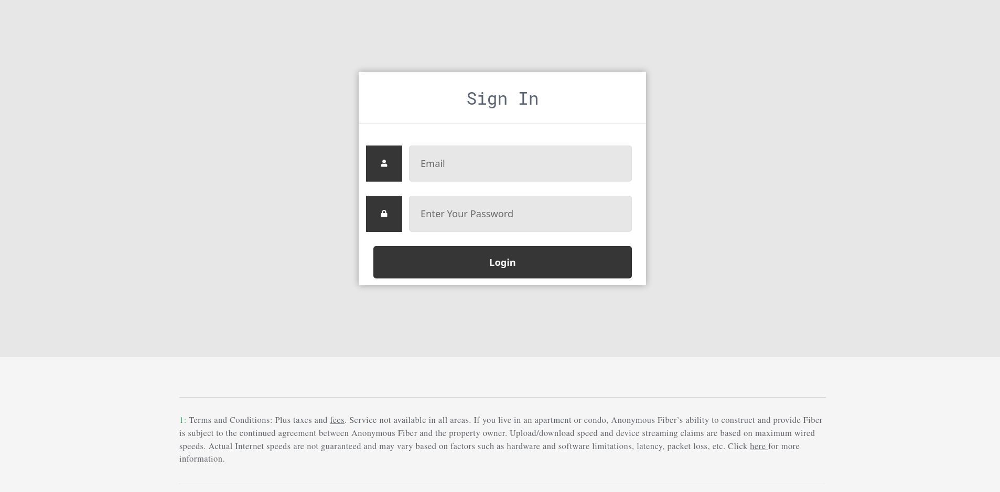

# Anonymous Fiber ::

**This is a web development project made with LAMP stack. Our mission while developing this website was to ensure the Internet becomes a global public resource that is open and accessible to all. An Internet that truly puts people's privacy and security first, where individuals can shape their own experience.**

```
L -> Linux
A -> Apache
M -> MySql/Mariadb
P -> PHP
```

# A glimpse of the website ::

https://user-images.githubusercontent.com/47687097/142181086-f92f6a0a-94e3-4f03-bfb7-ccd45544e432.mp4

# Core Features ::

- Well Planned Information Architecture
- Fast Load Times
- Effective Navigation
- Good Error Handling
- Contrasting Colour Scheme
- Browser Consistency
- Mobile Compatibility

# Additional Features ::

- Testimonials of users on homepage with zoom hover effect
- Fiber Plans also with zoom hover
- Backend system for customers with encrypted password storage
- All sensitive information is sent using the POST method
- Option to subscribe to anonymousfiber's mailing system
- Customers can log in and see their plans and raise issues
- Usable Forms: Interested customers can check whether fiber services are available in their area, and if services are available, then they can fill out a form

# Pages ::

- Homepage
- Fiber Cities
- Bussiness
- About Us
- Contact Us
- Sign In
- Profile Page
- Plan details
- Complaint
- New Connection
- Coming Soon

# Technology Stack Used ::


- Front End - **HTML, CSS, JavaScript**
- Back End - **PHP, phpMyAdmin**
- Database - **MySql**

# Requirements ::

[](https://github.com/radix007/anonymousfiber/)

The source code of this project is written in **PHP**. So, you'll require **LAMMP/XAMPP/MAMP/WAMP** to run this project.

# Installation (Linux system) ::

- Check out [this](https://www.tecmint.com/install-lamp-with-phpmyadmin-in-ubuntu-20-04/) guide to install LAMP

> Once you have installed LAMP, follow the subsequent steps:

```
> git clone https://github.com/radix007/anonymousfiber.git
> sudo cp -r anonymousfiber/ /var/www/html
```

- Create a new mysql/mariadb user:

```
> sudo systemctl start mysql.service

> sudo mysql -u root -p

> CREATE USER 'Fiber_User'@'localhost' IDENTIFIED BY 'anonymousfiber';

> GRANT ALL PRIVILEGES ON *.* TO 'Fiber_User'@'localhost' REQUIRE NONE WITH GRANT OPTION MAX_QUERIES_PER_HOUR 0 MAX_CONNECTIONS_PER_HOUR 0 MAX_UPDATES_PER_HOUR 0 MAX_USER_CONNECTIONS 0;

** For Arch/Manjaro **
> sudo systemctl start httpd.service

** For Debian/Ubuntu/Kali Linux **
> sudo systemctl start apache2
```

- Now navigate to youripaddress/anonymousfiber (this assumes that your LAMP/WAMP document root is /var/www/html and that you copied the anonymousfiber folder to the above path)

```
Type the below link in your browser. You can replace 127.0.0.1 with your IP address.

 127.0.0.1/anonymousfiber

** anonymousfiber homepage should open up right now. If it is not opening right now please make sure you have followed the steps above properly or pull an issue.
```

- Create Anonymous_Fiber Database:

```
> sudo mysql -u root -p

> CREATE DATABASE Anonymous_Fiber;

> exit
```

- Import Anonymous_Fiber Database:

```
> mysql -u <USERNAME> -p <DB NAME> < <dump file path>

For Example:

> mysql -u Fiber_User -p Anonymous_Fiber < /var/www/html/anonymousfiber/Anonymous_Fiber.sql

```

# Credentials for Sign In Page ::

```
 Username : mikeross@anonymousfiber.com

 Password : test

```



# Contributing ::

Please check out the [contributing.md](contributing.md) guide on how you can actively participate in the development of this web development project.

# License 

This project is licensed under the GNU General Public License v3.0 - see the [License.md](https://github.com/radix007/anonymousfiber/blob/testing/LICENSE) file for more details.
